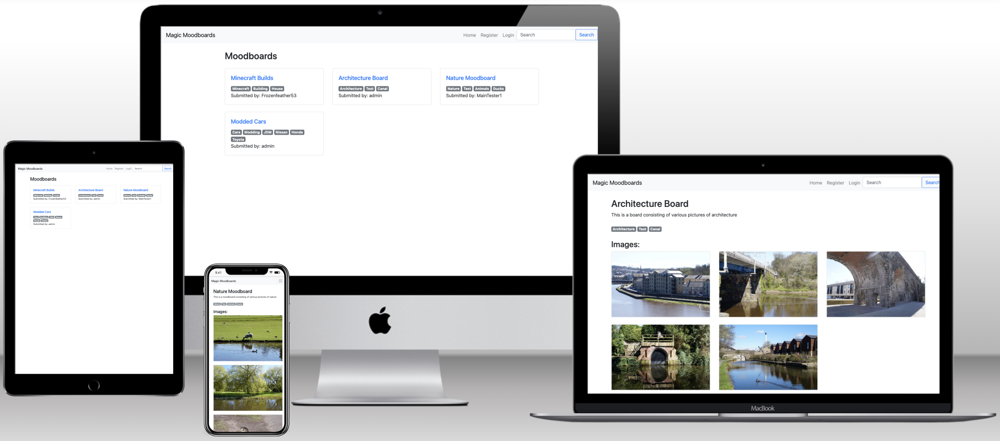
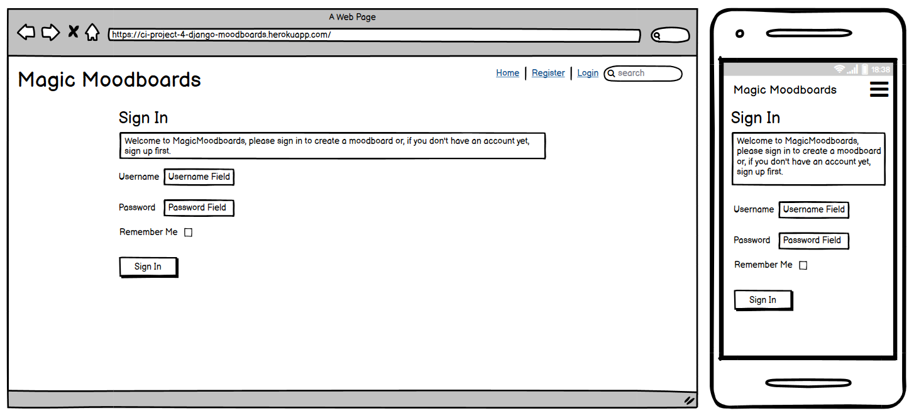
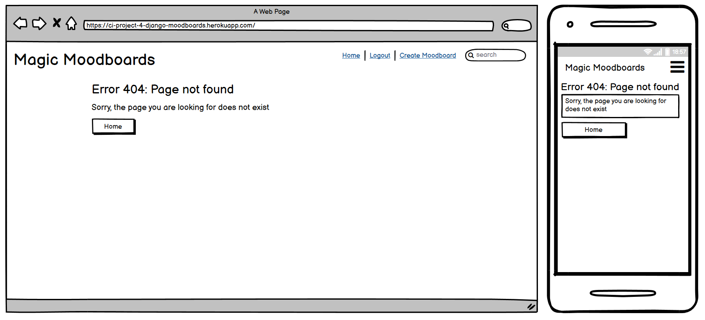
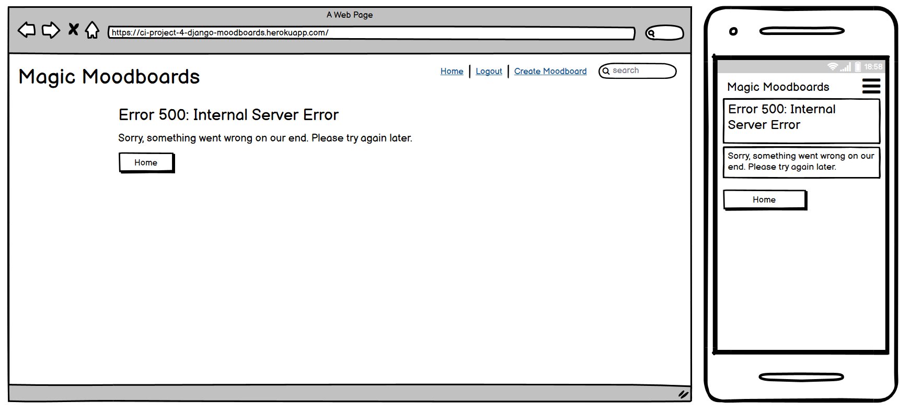

# Moodboards Site

## Table of Contents

* [User Experience Design (UX)](#user-experience-design)
    * [The Strategy Plane](#the-strategy-plane)
        * [Site Goals](#site-goals)
        * [Agile Planning](#agile-planning)
          * [Project Epics](#project-epics)
          * [User Stories](#user-stories)
    * [The Scope Plane](#the-scope-plane)
    * [The Structure Plane](#the-structure-plane)
      * [Features](#features)
    * [The Skeleton Plane](#the-skeleton-plane)
        * [Wireframes](#wireframes)
        * [Database Design](#database-design)
        * [Security](#security)
    * [The Surface Plane](#the-surface-plane)
        * [Design](#design)
            * [Colour Scheme](#colour-scheme)
            * [Typography](#typography)
            * [Imagery](#imagery)
* [Technologies](#technologies)
* [Testing](#testing)
* [Deployment](#deployment)
    * [Version Control](#version-control)
    * [Heroku Deployment](#heroku-deployment)
    * [Run Locally](#run-locally)
    * [Fork Project](#forkin-the-project)
* [Credits/References](#credits/references)

# User Experience Design

## The Strategy Plane

### Site Goals
This web app is designed to allow users to quickly and easily create and save image based 'Moodboards', which can be used for a variety of reasons such as having inspiration or references when working on a creative piece. It must be user friendly to use, whilst providing all essential functions such as creating, deleting and editing a moodboard, as well as browsing other user submitted boards on the site.

A live version of the site can be found [here](https://ci-project-4-django-moodboards.herokuapp.com/)

### Agile Planning
Aiding in the development of the project, agile methodologies were utilised, delivering small features in incremental sprints over a period of four weeks, with a total of three sprints. To prioritize tasks, I assigned them to epics and labeled them as "Must have," "Should have," or "Could have." Tasks were then story-pointed based on their complexity, with "Must have" stories taking precedence and completed first, followed by "Should haves," and finally "Could haves." This approach ensured that all core requirements were met before adding any additional features.

To monitor progress, a Kanban board was made by using Github Projects. You can access the board for more information on the project cards. All stories, except documentation tasks, have a full set of acceptance criteria that define the functionality necessary to mark a story as complete.
#### Project EPICs

**Setup**

The Setup epic focuses on setting up the foundational aspects of the application, such as configuring the development environment, integrating necessary libraries, and creating the initial project structure. This epic lays the groundwork for the entire application, ensuring all the other epics can be built upon a stable and well-configured base.

**Static/Standalone pages**

The Static/Standalone pages epic encompasses the creation and design of smaller, independent pages that are not directly related to the core functionalities but contribute to the overall user experience. These pages include the 404, 403 and 500 error pages which improve the user experience of the site if any of these errors are encountered by allowing the user to easily navigate home.

**Authentication**

The Authentication epic is responsible for implementing the user registration, login, and authorization features for the site. It ensures that users can securely create accounts, log in, and interact with protected views or features. This epic is crucial for enabling role-based access to certain functionalities, such as creating moodboards.

**Moodboards**

The Moodboards epic covers all stories related to creating, viewing, updating, and deleting moodboards. It enables users to manage their moodboards and interact with them through an intuitive user interface. This epic is central to the core functionality of the site, allowing users to fully engage with the moodboard creation and management process.

**Browsing/searching Moodboards**

The Browsing/searching Moodboards epic focuses on providing a seamless experience for users to browse and search for moodboards on the site. It includes the implementation of search functionality, filters, and sorting options, enabling users to find moodboards based on their preferences and interests quickly and efficiently.

**Deployment**

The Deployment epic handles all tasks related to deploying the application to a hosting platform, such as Heroku, so that it is accessible to users. This epic ensures that the site is live, functional, and available for users to access and interact with from various devices and locations.

**Documentation**

The Documentation epic covers all tasks associated with creating and maintaining documentation for the application. This includes documenting the software development lifecycle, providing detailed information on setup, deployment, and usage, and outlining any necessary troubleshooting or maintenance procedures. This epic aims to deliver comprehensive and accessible documentation, helping users, and developers better understand and interact with the application.

#### User Stories

The following user stories were completed for each epic across the 3 sprints:

**Setup**

As a **developer** I must **set up and configure the project** so that **initial development and implementation of core features can begin**

As a **developer** I must **create the static images, CSS and JS resources** so that **they can be used and accessed across the website.**
***As a developer***

As a **developer** I must **create a responsive navbar** so that **it can be included in the base.html file for easy navigation on the site on a range of devices**

As a **developer** I must **create the base.html page and structure ** so that **it can be included in most other pages on the site**
**Static/Standalone pages**

**Authentication**

As a **developer** I must **implement Allauth authentication** so that **users can login and sign up to the site**

**Moodboards**

As a **user** I want to be able to **create new mood boards** so that **I can use them for inspiration in projects**

As a **user** I would like to **be able to edit moodboard** so that **they can be modified or expanded on after creation, rather than creating a brand new one**
**Browsing/searching Moodboards**

As a **user** I would like to **be able to delete a moodboard I have created** in order to **remove moodboard that are no longer required or for completed projects**

As a **user** I would like to **view published moodboard** so that **they can be used for inspiration for projects**

**Deployment**

As a **developer** I must **deploy the project to Heroku** so that **it is live and accessible to users**

**Documentation**
Tasks:
- Finish README documentation writeup
- Finish testing documentation writeup
- 
## The Scope Plane

- Simple, user friendly interface throughout the site
- Responsive website design on various screen widths
- CRUD functionality on moodboards
- User based restrictions on features such as creating, editing and deleting moodboards

### Site Goals

### Agile Planning

#### Project EPICs

#### User Stories

## The Scope Plane

## The Structure Plane

### Features

## The Skeleton Plane

### Wireframes

**Index**

**Create**

**Edit**

**Detail**

**Login**

**Logout**

**Register**

**404**

**403**

**500**

### Database Design

### Security

## The Surface Plane

### Design 

### Colour Scheme

### Typography

### Imagery

## Technologies

## Testing

## Deployment

### Version Control

### Heroku Deployment

### Run Locally

### Forking the Project

## Credits/References 

